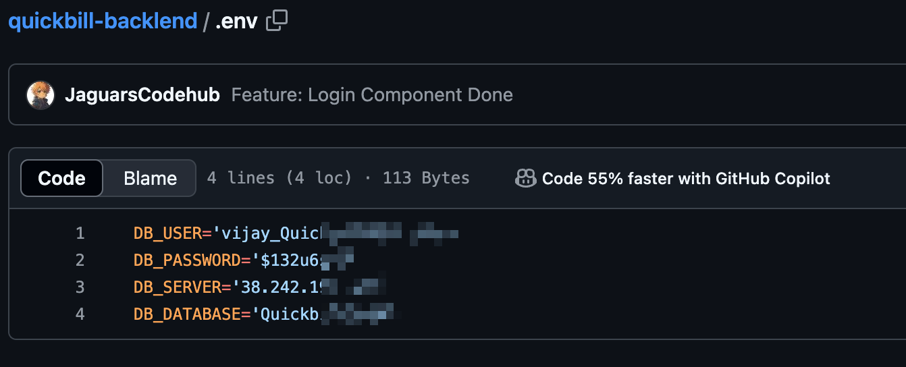

### Summary

This report identifies a critical security vulnerability resulting from the inadvertent leakage of the complete source code for **QuickBillBook** (https://www.quickbillbook.com/), which is developed and maintained by **Raviva Infotech Private Limited** (). The leaked information includes both client-side and server-side code along with database credentials that allow direct access to live data.

### Vulnerability Details

• **Date Discovered**: 2024/11/18

• **Location of Leak**: 
- Front-end source code: https://github.com/JaguarsCodehub/quickbill
- Back-end source code: https://github.com/JaguarsCodehub/quickbill-backlend
- Back-end database credentials: https://github.com/JaguarsCodehub/quickbill-backlend/blob/master/.env

• **Components Affected**:
- Front-end files
- Back-end API scripts
- Configuration files containing hardcoded database URLs, usernames, and passwords

• **Type of Vulnerability**: Information Disclosure, Configuration Error, Improper Access Control

• **Potential Impact**: The exposure of this sensitive data poses a significant risk, including but not limited to:
- Unauthorized data access and potential data manipulation
- Exposure of backend functionalities which could be exploited further
- Compromise of database integrity and confidentiality

### Vulnerability Reproduce

1. Navigate to Back-end source code https://github.com/JaguarsCodehub/quickbill-backlend.
2. Access the environment variables file to view hardcoded database credentials https://github.com/JaguarsCodehub/quickbill-backlend/blob/master/.env
3. Use the credentials at **38.242.197.\*\*** to log in and verify direct data access.

**Evidence**

### Suggested Immediate Remediation Actions

- Rotate all exposed credentials immediately to prevent unauthorized access.
- Implement strict access controls and review current security policies to prevent future leaks.
- Conduct a thorough security audit on all exposed systems to assess and remediate any damage or additional vulnerabilities.
- Avoid unnecessary open-sourcing of code by changing the visibility of GitHub repositories (or other version control repositories) from public to private to prevent unauthorized access.

